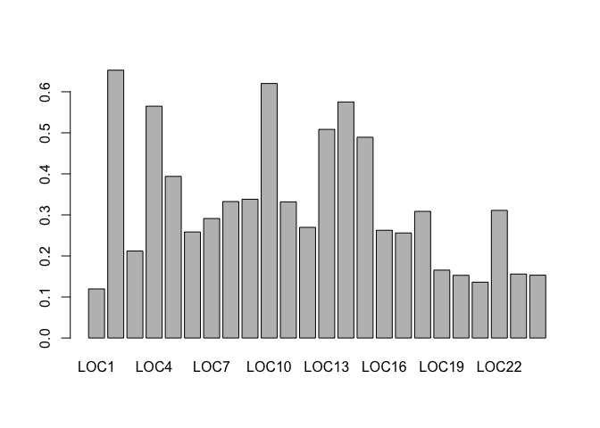

EVE 109 Section Week 3
================

### 1. Manipulating dataframes

As we saw last week, the most common class we work with in R is a dataframe. This week, we'll learn a few more ways to manipulate dataframes. This time we'll use the built in `iris` dataset:

``` r
data(iris)
head(iris)
```

    ##   Sepal.Length Sepal.Width Petal.Length Petal.Width Species
    ## 1          5.1         3.5          1.4         0.2  setosa
    ## 2          4.9         3.0          1.4         0.2  setosa
    ## 3          4.7         3.2          1.3         0.2  setosa
    ## 4          4.6         3.1          1.5         0.2  setosa
    ## 5          5.0         3.6          1.4         0.2  setosa
    ## 6          5.4         3.9          1.7         0.4  setosa

 

One quick way to explore the data is using `summary`:

``` r
summary(iris)
```

    ##   Sepal.Length    Sepal.Width     Petal.Length    Petal.Width   
    ##  Min.   :4.300   Min.   :2.000   Min.   :1.000   Min.   :0.100  
    ##  1st Qu.:5.100   1st Qu.:2.800   1st Qu.:1.600   1st Qu.:0.300  
    ##  Median :5.800   Median :3.000   Median :4.350   Median :1.300  
    ##  Mean   :5.843   Mean   :3.057   Mean   :3.758   Mean   :1.199  
    ##  3rd Qu.:6.400   3rd Qu.:3.300   3rd Qu.:5.100   3rd Qu.:1.800  
    ##  Max.   :7.900   Max.   :4.400   Max.   :6.900   Max.   :2.500  
    ##        Species  
    ##  setosa    :50  
    ##  versicolor:50  
    ##  virginica :50  
    ##                 
    ##                 
    ## 

For quantitative columns, this gives you basic summary statistics and for categorical columns it gives you counts of each value. We could have also looked at the categorical data using the `table` command:

``` r
table(iris$Species)
```

    ## 
    ##     setosa versicolor  virginica 
    ##         50         50         50

 

Let's take just the quantitative data for a moment:

``` r
quant <- iris[,1:4]
head(quant)
```

    ##   Sepal.Length Sepal.Width Petal.Length Petal.Width
    ## 1          5.1         3.5          1.4         0.2
    ## 2          4.9         3.0          1.4         0.2
    ## 3          4.7         3.2          1.3         0.2
    ## 4          4.6         3.1          1.5         0.2
    ## 5          5.0         3.6          1.4         0.2
    ## 6          5.4         3.9          1.7         0.4

 

For easy summaries of rows or columns, we can us the commands `colSums`, `colMeans`, `rowSums`, and `rowMeans`

``` r
means <- rowMeans(quant)
```

 

Maybe we want to add a column to the initial iris dataframe that has the mean of the different measurements. We can do that in two different ways:

``` r
iris$mean <- rowMeans(quant) # Caluclate and name the new column at the same time or...
means2 <- rowMeans(quant) # Calculate means
newiris <- cbind(iris,means2) # cbind (column bind) to iris dataframe
head(newiris)
```

    ##   Sepal.Length Sepal.Width Petal.Length Petal.Width Species  mean means2
    ## 1          5.1         3.5          1.4         0.2  setosa 2.550  2.550
    ## 2          4.9         3.0          1.4         0.2  setosa 2.375  2.375
    ## 3          4.7         3.2          1.3         0.2  setosa 2.350  2.350
    ## 4          4.6         3.1          1.5         0.2  setosa 2.350  2.350
    ## 5          5.0         3.6          1.4         0.2  setosa 2.550  2.550
    ## 6          5.4         3.9          1.7         0.4  setosa 2.850  2.850

     

### 2. Using the **adegenet** package to calulate heterozygosity

Today we'll use microsatellite data from the Weeks et al. (2017) paper using genetic analysis to look at the effects of population recovery after an introduction. Let's read in the file:

``` r
data <- read.csv("data/genotypes.csv") # Read in a file
```

Take a look at the data:

``` r
head(data)
```

    ##   ID      Pop Year    LOC1    LOC2    LOC3    LOC4    LOC5    LOC6    LOC7
    ## 1  1 MtBuller 2010 311/311 245/249 303/303 195/201 218/218 211/211 321/321
    ## 2  2 MtBuller 2010 311/311 245/249 303/303 195/201 218/218 211/211 321/321
    ## 3  3 MtBuller 2010 311/311 245/249 303/303   NA/NA 218/218 211/211 321/321
    ## 4  4 MtBuller 2010 311/311 249/249 303/303 195/195 218/218 211/211 321/321
    ## 5  5 MtBuller 2010 309/311 249/249 303/303 195/201 218/218 211/211 321/321
    ## 6  6 MtBuller 2010 309/311   NA/NA 303/303 201/201 218/218 211/211 321/321
    ##      LOC8    LOC9   LOC10   LOC11   LOC12   LOC13   LOC14   LOC15   LOC16
    ## 1 240/240 157/157 113/113 178/178 125/125 309/318 119/119 144/146 214/214
    ## 2 240/240 157/157 113/113 178/178 125/125 309/309 119/148 144/146 214/214
    ## 3 240/240 157/157 113/113 178/178 125/125 309/309 119/119 144/144 214/216
    ## 4 240/240 157/157 113/113 178/178 125/125 309/309 119/119 144/146 214/214
    ## 5 240/240 157/157 113/115 178/178 125/125 309/318 148/148 144/146 216/216
    ## 6 240/240 157/157 113/115 178/178 125/125 309/318 119/148 144/144 214/214
    ##     LOC17   LOC18   LOC19   LOC20   LOC21   LOC22   LOC23   LOC24
    ## 1 241/241 160/160 150/150 117/117 141/141 137/137 157/157 177/177
    ## 2 241/241 160/160 150/150 117/117 141/141 137/137 157/157 177/177
    ## 3 241/241 160/160 150/150 117/117 141/141 137/137 157/157 177/177
    ## 4 241/241 160/160 150/150 117/117 141/141 137/137 157/157 177/177
    ## 5 241/241 160/160 150/150 117/117 141/141 137/141 157/157 177/177
    ## 6 241/241 160/160 150/150 117/117 141/141 137/137 157/157 177/177

 

The first column is an id assigned to each individual. The second column gives the populations from which the individual was sampled. The third column gives the year of sampling. The remaining columns give the microsatellite data. Each individual has two numbers which represent the fragment lengths (read on a gel). If the two fragment lengths are the same, the individual is a heterozygote. If they are different, the individual is a homozygote.

We will use the package **adegenet** to read in the microsatellite data and calculate heterozygosity. The manual for this package is [here](https://github.com/thibautjombart/adegenet/wiki). Install the package and call the library:

``` r
install.packages("adegenet")
```

``` r
library(adegenet)
```

 

The first thing we need to do is let the adegenet read in the microsatellite data. We can do this with the `df2genind`. Let's ask for help on that command:

``` r
?df2genind
```

Look at the arguments. How can we format our allele data to meet the requirements of the package?

``` r
alleles <- data[,4:ncol(data)]
```

The function `ncol` gives us the number of columns. So here we are asking for all columns except the first three, which do not contain genotype data. Okay, let's see if that works

``` r
genind <- df2genind(alleles,sep="/",NA.char="NA/NA")
summary(genind)
```

    ## 
    ## // Number of individuals: 524
    ## // Group sizes: 524
    ## // Number of alleles per locus: 5 5 10 7 8 3 7 16 3 11 10 2 6 10 5 2 10 2 5 3 2 10 9 4
    ## // Number of alleles per group: 155
    ## // Percentage of missing data: 1.03 %
    ## // Observed heterozygosity: 0.12 0.68 0.29 0.6 0.48 0.3 0.36 0.38 0.35 0.64 0.43 0.22 0.54 0.6 0.5 0.21 0.38 0.25 0.25 0.17 0.17 0.39 0.26 0.25
    ## // Expected heterozygosity: 0.12 0.64 0.36 0.7 0.58 0.32 0.5 0.56 0.51 0.74 0.56 0.45 0.64 0.61 0.63 0.25 0.44 0.46 0.29 0.19 0.35 0.49 0.33 0.38

 

The object summary has most of the information we want:

``` r
results <- summary(genind)
names(results) # Show the different output values we can look at
```

    ## [1] "n"         "n.by.pop"  "loc.n.all" "pop.n.all" "NA.perc"   "Hobs"     
    ## [7] "Hexp"

``` r
results$Hobs # Show observed heterozygosity
```

    ##      LOC1      LOC2      LOC3      LOC4      LOC5      LOC6      LOC7 
    ## 0.1150097 0.6812749 0.2913386 0.5984405 0.4799235 0.2972973 0.3556405 
    ##      LOC8      LOC9     LOC10     LOC11     LOC12     LOC13     LOC14 
    ## 0.3754864 0.3512476 0.6382979 0.4335260 0.2160612 0.5393474 0.5965583 
    ##     LOC15     LOC16     LOC17     LOC18     LOC19     LOC20     LOC21 
    ## 0.4990366 0.2103250 0.3754789 0.2471264 0.2480620 0.1739962 0.1685824 
    ##     LOC22     LOC23     LOC24 
    ## 0.3850575 0.2553191 0.2528736

 

Notice that observed and expected heterozygosity has been calculated, but across the entire dataset. What if we supply different populations? We use the `seppop` function to tell it we want separate measurements for each population

``` r
genindPop <- df2genind(alleles,sep="/",
                    NA.char="NA/NA",
                    pop=data$Pop)
genindPop <- seppop(genindPop)
genindPop
```

    ## $MtBuller
    ## /// GENIND OBJECT /////////
    ## 
    ##  // 420 individuals; 24 loci; 155 alleles; size: 316.3 Kb
    ## 
    ##  // Basic content
    ##    @tab:  420 x 155 matrix of allele counts
    ##    @loc.n.all: number of alleles per locus (range: 2-16)
    ##    @loc.fac: locus factor for the 155 columns of @tab
    ##    @all.names: list of allele names for each locus
    ##    @ploidy: ploidy of each individual  (range: 2-2)
    ##    @type:  codom
    ##    @call: .local(x = x, i = i, j = j, treatOther = ..1, quiet = ..2, drop = drop)
    ## 
    ##  // Optional content
    ##    @pop: population of each individual (group size range: 420-420)
    ## 
    ## $MtHigginbotham
    ## /// GENIND OBJECT /////////
    ## 
    ##  // 104 individuals; 24 loci; 155 alleles; size: 102.7 Kb
    ## 
    ##  // Basic content
    ##    @tab:  104 x 155 matrix of allele counts
    ##    @loc.n.all: number of alleles per locus (range: 2-16)
    ##    @loc.fac: locus factor for the 155 columns of @tab
    ##    @all.names: list of allele names for each locus
    ##    @ploidy: ploidy of each individual  (range: 2-2)
    ##    @type:  codom
    ##    @call: .local(x = x, i = i, j = j, treatOther = ..1, quiet = ..2, drop = drop)
    ## 
    ##  // Optional content
    ##    @pop: population of each individual (group size range: 104-104)

 

Notice the two locations are now separate. We can get the heterozygosity separately for each population:

``` r
MtBuller <- summary(genindPop$MtBuller)
MtHiggenbotham <- summary(genindPop$MtHigginbotham)
MtBuller$Hobs # Observed heterozygosity for all Mt Buller Samples
```

    ##      LOC1      LOC2      LOC3      LOC4      LOC5      LOC6      LOC7 
    ## 0.1196172 0.6526055 0.2120482 0.5649038 0.3937947 0.2583732 0.2911695 
    ##      LOC8      LOC9     LOC10     LOC11     LOC12     LOC13     LOC14 
    ## 0.3325359 0.3381295 0.6201923 0.3317422 0.2696897 0.5083532 0.5751790 
    ##     LOC15     LOC16     LOC17     LOC18     LOC19     LOC20     LOC21 
    ## 0.4892086 0.2625298 0.2559809 0.3086124 0.1654676 0.1527446 0.1360382 
    ##     LOC22     LOC23     LOC24 
    ## 0.3110048 0.1558753 0.1531100

``` r
MtBuller$Hexp # Expected heterozygosity for all Mt Buller Samples
```

    ##      LOC1      LOC2      LOC3      LOC4      LOC5      LOC6      LOC7 
    ## 0.1129982 0.6064596 0.2329279 0.6085111 0.4022334 0.2458735 0.2869544 
    ##      LOC8      LOC9     LOC10     LOC11     LOC12     LOC13     LOC14 
    ## 0.3583595 0.3399151 0.6384350 0.3431457 0.3045010 0.5145363 0.5734332 
    ##     LOC15     LOC16     LOC17     LOC18     LOC19     LOC20     LOC21 
    ## 0.5079217 0.3030058 0.2639076 0.3282291 0.1647056 0.1750275 0.1629775 
    ##     LOC22     LOC23     LOC24 
    ## 0.3484438 0.1637021 0.1735194

     

### Plotting heterozygosity

Let's use a barplot to look at variation in heterozygostiy across all our markers:

``` r
barplot(MtBuller$Hobs)
```



When we have a bunch of markers, we often take the mean across all those markers:

``` r
mean(MtHiggenbotham$Hobs) # Mean observed heterozygosity in the Mt Higgenbotham population
```

    ## [1] 0.5262125

Compare this value to the paper.

     

Homework
========

Now that we know how to estimate observed and expected heterozygosity, we'll look at changes over time. Start a new script for your homework

### *Homework 3: Write a script that does the following:*

#### 1. Read in "genotypes.csv" and subset the dataframe to Mt Buller samples only. How many samples do you have from each year?

#### 2. Calculate mean observed heterozygosity for each year. Put these into a single dataframe along with a column indicating the year.

#### 3. Calculate mean expected heterozygosity for each year. Add these to the dataframe from question 2.

#### 4. Plot mean expected heterozygosity over time.

#### 5. Add a vertical lines to your plot to show when introductions took place (hint - use the `abline` command)
